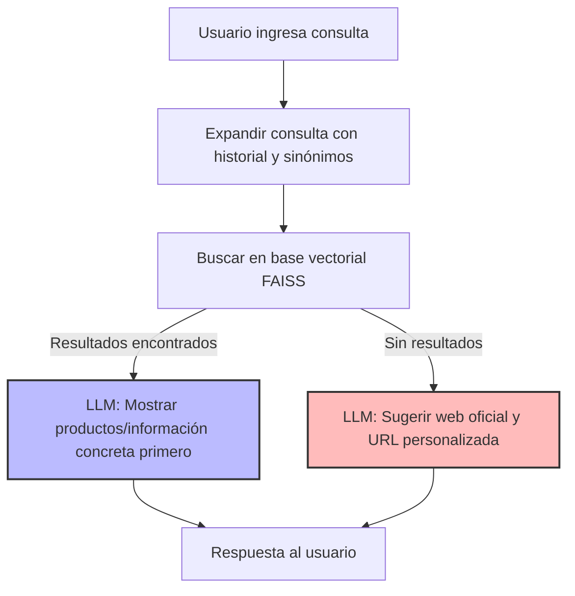
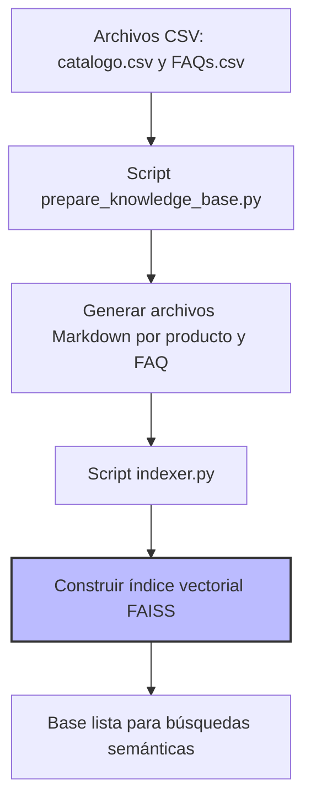

# Casa Mueble: Asistente Virtual RAG

Este proyecto implementa un chatbot basado en Retrieval Augmented Generation (RAG) para la empresa de muebles Casa Mueble. El asistente utiliza una base de conocimientos vectorizada (FAISS) y un modelo de lenguaje (LLM) para responder preguntas sobre productos, servicios y políticas de la empresa.

## ¿Cómo funciona el asistente?

1. **El usuario ingresa una consulta** (por ejemplo: "¿Tienen mesas de comedor de 6 personas?" o "¿Cuánto cuesta el fogonero grande?").
2. El sistema **expande la consulta** con sinónimos y contexto del historial para mejorar la búsqueda.
3. Se realiza una **búsqueda semántica en la base vectorial FAISS** (que contiene información de productos y FAQs vectorizada desde archivos CSV procesados a Markdown).
4. Si se encuentran resultados relevantes, **el LLM genera una respuesta** mostrando primero las opciones concretas de productos/información encontrada, citando fuente y evitando preguntas innecesarias.
5. Si no hay información relevante, el asistente **genera una respuesta contextualizada** sugiriendo visitar la web oficial y, si corresponde, una URL personalizada de búsqueda.

### Diagrama del flujo de consulta y respuesta



---

## Flujo de carga y vectorización de la base de conocimiento

La base de conocimiento se construye y vectoriza en los siguientes pasos:



---

## Dependencias principales

- **langchain**: Framework para construir cadenas de procesamiento con LLMs y herramientas de búsqueda.
- **langchain_community**: Conectores y utilidades para integración con FAISS y otros recursos.
- **langchain-huggingface**: Soporte para embeddings y LLMs de HuggingFace.
- **langchain-openai**: Soporte para modelos de OpenAI (GPT-3.5, GPT-4, etc).
- **huggingface-hub**: Descarga y gestión de modelos desde HuggingFace.
- **faiss-cpu**: Motor de búsqueda vectorial eficiente para recuperación semántica.
- **sentence-transformers**: Modelos de embeddings para vectorizar textos.
- **pandas**: Procesamiento de datos tabulares (CSV a Markdown).
- **python-dotenv**: Carga de variables de entorno desde archivos .env.
- **beautifulsoup4, markdownify**: Procesamiento y limpieza de HTML/Markdown.
- **unidecode**: Normalización de texto.
- **scikit-learn, numpy**: Utilidades para procesamiento de texto y datos.
- **tqdm**: Barras de progreso en scripts de procesamiento.

---

## Resumen de funcionamiento

- **Toda la información mostrada al usuario proviene de la base vectorial FAISS y el LLM.**
- **No se consulta directamente el CSV ni se usa TF-IDF en tiempo real**: todo se vectoriza previamente.
- **El asistente prioriza mostrar productos concretos y evita demorar con preguntas innecesarias.**
- **Si no hay información relevante, sugiere la web oficial y arma una URL personalizada de búsqueda.**

> **Nota:** Para actualizar la base de conocimiento, edita los archivos CSV y ejecuta `prepare_knowledge_base.py` seguido de `indexer.py` o el comando `python manage_knowledge_base.py rebuild`.

---

## Gestión del histórico de conversación

El asistente mantiene el histórico de la conversación en memoria durante cada sesión, lo que permite respuestas contextuales y personalizadas. Cada mensaje del usuario y del asistente se agrega a una lista, que se utiliza para enriquecer el contexto de las respuestas del LLM.

- **Ventaja:** El contexto se mantiene y se adapta la conversación en tiempo real.
- **Limitación:** El histórico no se guarda entre sesiones ni es accesible desde otros dispositivos.

### Ejemplo de estructura en memoria
```python
chat_history = [
    {"role": "user", "content": "¿Tienen mesas de comedor de 6 personas?"},
    {"role": "assistant", "content": "Sí, tenemos varias opciones..."},
    ...
]
```

---

## Integración con Supabase para histórico y base vectorial

Para persistir el histórico de conversación y/o la base vectorial, se puede integrar Supabase de forma simple usando su API REST. Esto permite guardar y consultar el historial de cada usuario, y almacenar archivos o metadatos de la base vectorial.

### Ejemplo de guardado de mensajes en Supabase
```python
import requests
SUPABASE_URL = "https://<your-project>.supabase.co"
SUPABASE_KEY = "<your-api-key>"
headers = {
    "apikey": SUPABASE_KEY,
    "Authorization": f"Bearer {SUPABASE_KEY}",
    "Content-Type": "application/json"
}
def save_message(user_id, role, content):
    data = {"user_id": user_id, "role": role, "content": content}
    requests.post(f"{SUPABASE_URL}/rest/v1/chat_history", headers=headers, json=data)
```
- Crea una tabla `chat_history` en Supabase con campos: `user_id`, `timestamp`, `role`, `content`.
- Llama a `save_message` cada vez que se agrega un mensaje al historial.

### Para la base vectorial
- Puedes subir el archivo `index.faiss` a Supabase Storage tras cada actualización.
- O guardar los metadatos/documentos en una tabla para trazabilidad.

**Ventajas:**
- No agrega dependencias pesadas (solo `requests` o `httpx`).
- Permite persistencia, análisis y multi-dispositivo.

---

## Cómo levantar la base de conocimiento y el chatbot

1. **Preparar la base de conocimiento**
   - Edita los archivos CSV (`knowledge_base/catalogo.csv` y `knowledge_base/FAQs.csv`) o ajusta la URL de la web en tu archivo `.env`:
     ```env
     CASAMUEBLE_WEB_URL=https://casamueble.com.ar/productos
     ```
   - Ejecuta:
     ```bash
     python prepare_knowledge_base.py
     ```
   - Esto generará los archivos Markdown a partir de los CSV y la web.

2. **Construir el índice vectorial**
   - Ejecuta:
     ```bash
     python indexer.py
     ```
   - Esto creará el índice FAISS en la carpeta `faiss_index/`.

3. **Levantar el chatbot**
   - Ejecuta:
     ```bash
     python main.py
     ```
   - El asistente estará listo para responder consultas usando la base vectorial y el LLM.

> **Nota:** Si cambias los datos fuente, repite los pasos 1 y 2 antes de volver a levantar el chatbot.

---

## Notas y pendientes para revisión/corrección

- **Precios:** Actualmente, los precios que muestra el asistente pueden no ser exactos o estar desactualizados, ya que dependen de la calidad y estructura de los datos fuente (CSV o web). Se recomienda revisar y mejorar la extracción y normalización de precios en futuras versiones.
- **Fuentes de datos:** El sistema ya permite sumar datos desde la web y CSV, pero se puede seguir mejorando la estructura de los documentos Markdown para optimizar la recuperación semántica.
- **Persistencia del histórico:** El histórico de conversación es solo en memoria. Para producción, se recomienda persistirlo (por ejemplo, en Supabase) para trazabilidad y análisis.
- **Pruebas:** El flujo de pruebas y validación está documentado, pero se sugiere agregar tests automáticos para verificar la presencia y formato de precios y atributos clave en las respuestas.
- **Documentación:** El README y los scripts están actualizados a la fecha (16/05/2025), pero cualquier cambio en el pipeline debe reflejarse aquí para mantener la trazabilidad.

> _Este informe sirve como guía para la corrección y mejora continua del proyecto._

---

## Salvedad de la autora

Este proyecto incluye una ampliación realizada por la alumna que desarrolló el challenge original. Además de cumplir con los requisitos planteados, se extendió la base de conocimiento y los casos de uso para enriquecer la experiencia y ejercitar el sistema con datos más representativos y realistas. Para ello, se tomó como caso de estudio una empresa dedicada a la comercialización de muebles, permitiendo así explorar escenarios más complejos y relevantes.

Todos los detalles adicionales, documentación ampliada y recursos complementarios se encuentran dentro de la carpeta `solucion_daniela_final` del proyecto.